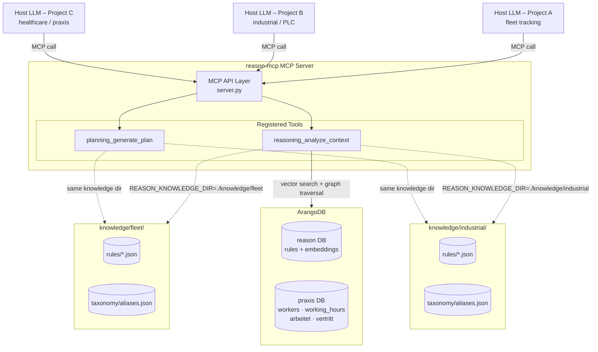

# reason-mcp: General-Purpose MCP Server Architecture

## Purpose

`reason-mcp` is a **single, domain-agnostic MCP server** that hosts the Reasoning and
Planning tools. Any project deploys the same server binary and injects its own domain
knowledge at runtime by setting one environment variable. No code changes are needed
to switch domains.

---

## 1. Server Architecture Diagram



**Key point:** the server code never changes between deployments — only the knowledge
directory and its JSON files change.  ArangoDB stores both the rules (with embeddings)
and any domain graph data used for graph traversal retrieval.

---

## 2. Project Layout

```
reason-mcp/
├── src/
│   └── reason_mcp/               # installable Python package
│       ├── server.py             # FastMCP server – registers all tools
│       ├── config.py             # env-var based config (REASON_*)
│       ├── tools/
│       │   ├── reasoning/
│       │   │   ├── tool.py       # MCP tool handler (pipeline orchestrator)
│       │   │   ├── pruner.py     # Zero-Value Pruner          REQ-016
│       │   │   ├── normalizer.py # Semantic Normalizer        REQ-010
│       │   │   ├── filter.py     # Candidate Rule Filter + graph traversal
│       │   │   ├── embedder.py   # Embedding model + index management
│       │   │   └── compressor.py # Lean Context Injector      REQ-003
│       │   └── planning/
│       │       ├── tool.py       # MCP tool handler
│       │       ├── graph.py      # Execution Graph Generator  REQ-027
│       │       └── simulator.py  # Dry Run Simulator          REQ-025
│       ├── knowledge/
│       │   ├── loader.py         # JSON loader + LRU cache
│       │   └── arango_client.py  # ArangoDB: rules DB + praxis graph DB
│       └── models/
│           ├── reasoning.py      # Pydantic request/response models
│           └── planning.py       # Pydantic request/response models
│
├── knowledge/                    # Runtime knowledge stores (per project)
│   ├── README.md                 # How to structure a knowledge directory
│   └── example/                  # Shipped reference fixtures
│       ├── rules/example_rules.json
│       └── taxonomy/aliases.json
│
├── seeds/                        # Graph seed data (JSON, domain-specific)
│   ├── nodes/
│   │   ├── workers.json          # Worker nodes (praxis domain)
│   │   └── working_hours.json    # WorkingHours nodes (praxis domain)
│   └── edges/
│       ├── arbeitet.json         # Worker → WorkingHours edges
│       └── vertritt.json         # Worker → Worker substitution edges
│
├── scripts/
│   ├── seed_arango.py            # Upsert rules + embeddings into ArangoDB
│   ├── seed_praxis_graph.py      # Upsert praxis graph nodes + edges
│   └── start_arango.sh           # Start ArangoDB via Docker (detached)
│
├── tests/
│   ├── test_reasoning.py         # Unit tests for all pipeline stages
│   └── test_planning.py          # Unit tests for simulator
│
├── pyproject.toml                # Build + dev dependencies
├── .env.example                  # All REASON_* env vars documented
└── .python-version               # 3.13
```

---

## 3. Deployment & Configuration

### Environment variables

| Variable | Default | Description |
|---|---|---|
| `REASON_KNOWLEDGE_DIR` | `./knowledge` | Path to the project knowledge folder |
| `REASON_DEFAULT_TOP_K` | `3` | Max rules injected per call |
| `REASON_MIN_RELEVANCE` | `0.5` | Minimum relevance threshold (0–1) |
| `REASON_MAX_SUMMARY_CHARS` | `900` | Budget for `summary_for_llm` field |
| `REASON_LOG_LEVEL` | `INFO` | Structured log level |
| `REASON_LOG_REQUESTS` | _(off)_ | Write each MCP request as a Markdown session log |
| `REASON_OUTPUT_DIR` | `./output` | Directory for session log files |
| **ArangoDB — rules DB** | | |
| `REASON_ARANGO_URL` | `http://localhost:8529` | ArangoDB server URL |
| `REASON_ARANGO_USER` | `root` | ArangoDB username |
| `REASON_ARANGO_PASSWORD` | _(required)_ | ArangoDB password |
| `REASON_ARANGO_DB` | `reason` | Database name for rule storage |
| `REASON_ARANGO_RULES_COLL` | `rules` | Collection for rule documents |
| `REASON_ARANGO_EDGES_COLL` | `rule_relations` | Collection for rule relationship edges |
| **ArangoDB — praxis graph DB** | | |
| `REASON_PRAXIS_DB` | `praxis` | Database name for the praxis domain graph |
| `REASON_PRAXIS_GRAPH_NAME` | `praxis_graph` | Name of the ArangoDB named graph |
| `REASON_PRAXIS_VERTEX_SPECS` | `Worker:workers:worker_,WorkingHours:working_hours:hours_` | Comma-separated vertex spec triples: `TypeName:collection:key_prefix` |
| `REASON_PRAXIS_EDGE_SPECS` | `arbeitet:arbeitet:workers:working_hours,vertritt:vertritt:workers:workers` | Comma-separated edge spec quads: `TypeName:collection:from_collection:to_collection` |

### Running the server

```bash
# 1. Create and activate the virtual environment
python3 -m venv .venv && source .venv/bin/activate

# 2. Install (editable for development)
pip install -e ".[dev]"

# 3. Point at the project knowledge directory
export REASON_KNOWLEDGE_DIR=./knowledge/example

# 4. Start the MCP server (stdio transport by default)
reason-mcp
```

### Adding a new domain / project

1. Create `knowledge/<project-name>/rules/` and `taxonomy/`.
2. Add domain rule packs as JSON files following the schema.  Embed any physical constants or domain facts directly in rule conditions.
3. Run `scripts/seed_arango.py` to embed and upsert the rules into ArangoDB.
4. Set `REASON_KNOWLEDGE_DIR=./knowledge/<project-name>` and restart.

No Python code changes required for adding a plain rule-based domain.

### Adding a graph domain

1. Create `seeds/nodes/<entity>.json` and `seeds/edges/<relationship>.json` following the existing praxis schema.
2. Add the new vertex/edge collection names to `config.py` and `arango_client.py`.
3. Run `scripts/seed_praxis_graph.py` (or equivalent) to embed and upsert nodes and edges.
4. Extend `filter.py`'s `_graph_candidates()` if the new domain needs a different traversal depth or direction.

---

## 4. General-Purpose Design Principles

1. **Domain-agnostic server** – a single deployable, no per-project forks.
2. **Lean Context Injection** – only `top_k` rules (with any embedded facts as conditions) reach the LLM.
3. **LLM does the reasoning** – the server retrieves; the LLM interprets.
4. **ArangoDB backed** – both the rules DB (`reason`) and the domain graph DB (`praxis`) run in ArangoDB.  Rules carry 384-dim embeddings for vector search; graph nodes carry embeddings for semantic node lookup.  JSON files remain the authoring source; the seed scripts populate ArangoDB.
5. **Semantic retrieval** – every request embeds the query text and searches the ArangoDB vector index (`APPROX_NEAR_COSINE`); catch-all rules (no trigger criteria) ensure baseline guidance is never silently dropped.
6. **Graph traversal** – when `domain=praxis` (or a graph query is active), `filter.py` searches the praxis node collections semantically, then traverses 1-hop OUTBOUND to collect linked nodes (e.g. WorkingHours via `arbeitet`, substitutes via `vertritt`).  Graph results are shaped into rule-like dicts and ranked alongside regular rule hits.
