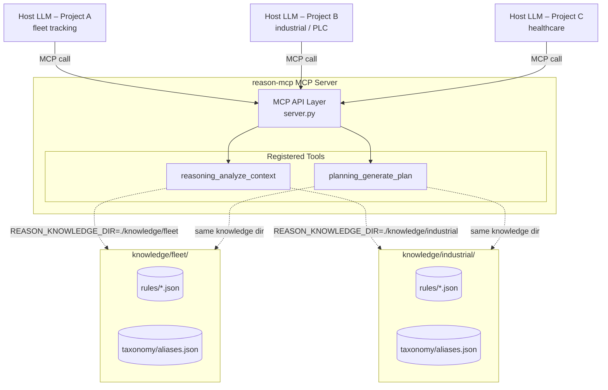

# reason-mcp: General-Purpose MCP Server Architecture

## Purpose

`reason-mcp` is a **single, domain-agnostic MCP server** that hosts the Reasoning and
Planning tools. Any project deploys the same server binary and injects its own domain
knowledge at runtime by setting one environment variable. No code changes are needed
to switch domains.

---

## 1. Server Architecture Diagram



**Key point:** the server code never changes between deployments — only the knowledge
directory and its JSON files change.

---

## 2. Project Layout

```
reason-mcp/
├── src/
│   └── reason_mcp/               # installable Python package
│       ├── server.py             # FastMCP server – registers all tools
│       ├── config.py             # env-var based config (REASON_*)
│       ├── tools/
│       │   ├── reasoning/
│       │   │   ├── tool.py       # MCP tool handler (pipeline orchestrator)
│       │   │   ├── pruner.py     # Zero-Value Pruner          REQ-016
│       │   │   ├── normalizer.py # Semantic Normalizer        REQ-010
│       │   │   ├── filter.py     # Candidate Rule Filter
│       │   │   └── compressor.py # Lean Context Injector      REQ-003
│       │   └── planning/
│       │       ├── tool.py       # MCP tool handler
│       │       ├── graph.py      # Execution Graph Generator  REQ-027
│       │       └── simulator.py  # Dry Run Simulator          REQ-025
│       ├── knowledge/
│       │   └── loader.py         # JSON loader + LRU cache
│       └── models/
│           ├── reasoning.py      # Pydantic request/response models
│           └── planning.py       # Pydantic request/response models
│
├── knowledge/                    # Runtime knowledge stores (per project)
│   ├── README.md                 # How to structure a knowledge directory
│   └── example/                  # Shipped reference fixtures
│       ├── rules/example_rules.json
│       └── taxonomy/aliases.json
│
├── tests/
│   ├── test_reasoning.py         # Unit tests for all 5 pipeline stages
│   └── test_planning.py          # Unit tests for simulator
│
├── pyproject.toml                # Build + dev dependencies
├── .env.example                  # All REASON_* env vars documented
└── .python-version               # 3.13
```

---

## 3. Deployment & Configuration

### Environment variables

| Variable | Default | Description |
|---|---|---|
| `REASON_KNOWLEDGE_DIR` | `./knowledge` | Path to the project knowledge folder |
| `REASON_DEFAULT_TOP_K` | `3` | Max rules injected per call |
| `REASON_MIN_RELEVANCE` | `0.5` | Minimum relevance threshold (0–1) |
| `REASON_MAX_SUMMARY_CHARS` | `900` | Budget for `summary_for_llm` field |
| `REASON_LOG_LEVEL` | `INFO` | Structured log level |

### Running the server

```bash
# 1. Create and activate the virtual environment
python3 -m venv .venv && source .venv/bin/activate

# 2. Install (editable for development)
pip install -e ".[dev]"

# 3. Point at the project knowledge directory
export REASON_KNOWLEDGE_DIR=./knowledge/example

# 4. Start the MCP server (stdio transport by default)
reason-mcp
```

### Adding a new domain / project

1. Create `knowledge/<project-name>/rules/` and `taxonomy/`.
2. Add domain rule packs as JSON files following the schema.  Embed any physical constants or domain facts directly in rule conditions.
3. Set `REASON_KNOWLEDGE_DIR=./knowledge/<project-name>` and restart.

No Python code changes required.

---

## 4. General-Purpose Design Principles

1. **Domain-agnostic server** – a single deployable, no per-project forks.
2. **Lean Context Injection** – only `top_k` rules (with any embedded facts as conditions) reach the LLM.
3. **LLM does the reasoning** – the server retrieves; the LLM interprets.
4. **JSON-first, DB-ready** – knowledge starts as JSON files; migration to SQLite via the same loader interface requires no tool changes.
5. **Deterministic retrieval** – identical inputs → identical knowledge bundle, always.
