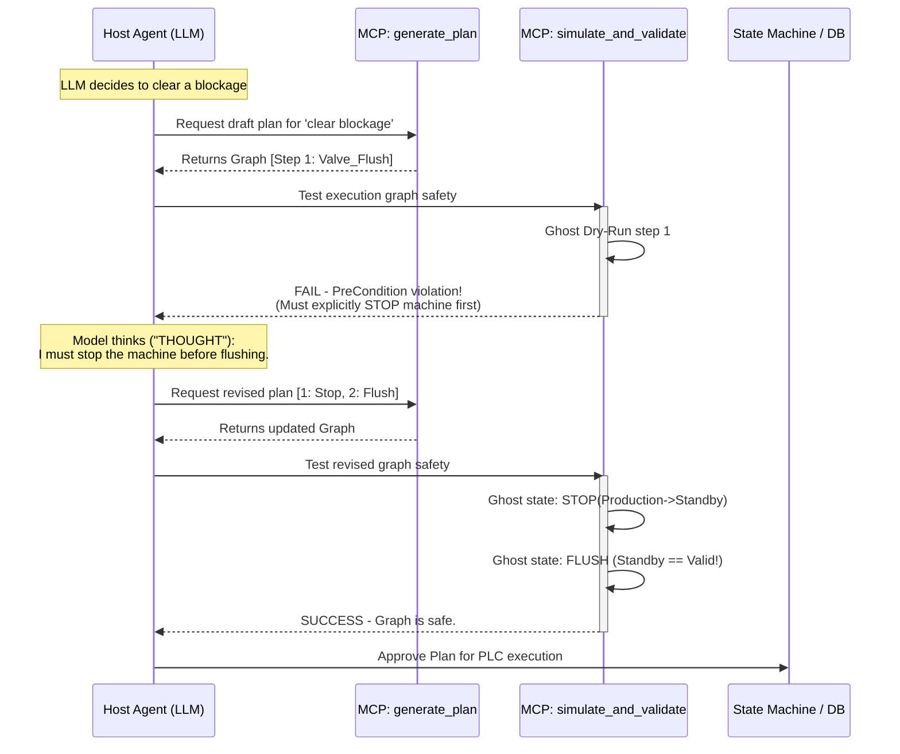

# Knowledge-Augmented Planning Tool: Detailed Architecture

## Overview
The **Planning Tool** (`planning_generate_plan`) is the second tool hosted on the **general-purpose `reason-mcp` server**. It translates abstract goals and deterministic insights (provided by the Reasoning Tool) into executable steps. It acts as a safety-first state machine, ensuring that an LLM cannot enforce unverified, dangerous actions on physical systems. It achieves this by shifting away from text-based step lists to an **Execution Graph (DAG)** validated through **Pre/Post-condition Dry Runs**.

---

## 1. System Component Diagram

```mermaid
flowchart TD
    %% External Entities
    Client[Host LLM / Agent]
    ExecEngine[Orchestrator / PLC / SPS]

    %% Planning MCP Subsystems
    subgraph Planning_MCP_Service [Planning MCP Tool]
        
        API[MCP API Layer]
        
        subgraph GraphGeneration [Planning Engine]
            GoalMatcher[Goal & Constrain Matcher]
            PlanGen[Execution Graph Generator\nREQ-027]
        end
        
        subgraph ValidationLayer [Safety & Simulation]
            Sim[Dry Run Simulator\nREQ-025]
            PrePost[Condition Verifier\nREQ-024]
        end
        
        subgraph Lifecycle [State Management]
            StateMachine[State Machine Manager]
            Replanner[Replanning Engine]
            Tracker[Step Execution Tracker]
        end
    end

    %% Data Stores
    subgraph Storage [Planning Rule Stores]
        Strategies[(Planning Strategies)]
        Skills[(Atom Skills / Actions)]
        ComponentKnowledge[(Component Knowledge\nREQ-026)]
        Policies[(Priority Policies)]
    end

    %% Flow connections
    Client -- "generate_plan(goal)" \n "simulate_and_validate(plan)" --> API
    
    API <--> GraphGeneration
    API <--> ValidationLayer
    API <--> Lifecycle
    
    GraphGeneration <--> Storage
    ValidationLayer <--> ComponentKnowledge
    ValidationLayer <--> Skills
    
    Lifecycle -- "update_status(step, outcome)" --> API
    ExecEngine -. "Reports status to Host" .-> Client
```

---

## 2. Core Components Deep Dive

### 2.1 Execution Graph Generator
*   **Responsibility:** Takes a defined goal, strategy, and available skills and creates a structured Dependency Graph (DAG) for execution (`REQ-027`).
*   **Mechanism:** Rather than outputting steps 1, 2, 3, it groups actions, utilizing `wait_for` mapping to empower orchestrators (like PLCs) to handle safe parallelization.

### 2.2 Knowledge Engine (Separated Concerns)
*   **`Skills` DB:** Defines raw actions (e.g., `VALVE_FLUSH`). Crucially, holds explicit machine state properties: `pre_conditions` (must be true to run) and `post_conditions` (mutations applied after running) (`REQ-024`).
*   **`Component_Knowledge` DB:** A specialized repository ensuring physical facts limit planning (`REQ-026`). Even if a general strategy suggests "Flush to clean", the Component Knowledge DB might explicitly state: "Component [Pump A] restricts flush pressure to < 10 bar." 

### 2.3 Dry Run Simulator (ReAct Enforcer)
*   **Responsibility:** Enables the crucial `simulate_and_validate` MCP interface (`REQ-025`).
*   **Mechanism:** Initiates a ghost/simulated internal world state. Iterates over the LLM-drafted Execution Graph. At every node, it evaluates the `pre_conditions`. If valid, it updates the ghost state with `post_conditions` and moves to the next node.
*   **Output:** If a step fails, it throws a precise deterministic exception directly back to the LLM (e.g., `Validation failed at Step 2: VALVE_FLUSH requires SystemState == STANDBY, but current state is PRODUCTION.`). 

### 2.4 State Machine Manager
*   **Responsibility:** Tracks a plan's lifecycle across states: `draft` -> `approved` -> `executing` -> `failed` -> `completed`.
*   **Mechanism:** Interacts heavily with `update_status` MCP. If a step fails executing on the PLC, the manager downgrades the state, locks further execution graph traversals, and emits a notification triggering the Replanner.

---

## 3. Execution Flow (Self-Correction Sequence Diagram)

This specifically illustrates the **ReAct (Reason + Act)** Loop, demonstrating how the LLM iteratively refines a physical strategy until it is verified safe by the local tool.



---

## 4. Key Design Decisions & Guiding Principles
1.  **Trust, But Verify:** SLMs/LLMs are highly prone to hallucinating parameters when doing step-by-step logic. The simulator forces physical and logic invariants on the agent.
2.  **No Action Without Simulation:** The system rejects shifting any plan to `approved` unless a full traversal of the simulator yields a clean `pre_condition` pass.
3.  **Graph, not Lists:** Industrial operations require real-time interlocking. Encoding dependencies in YAML via `wait_for` keys allows seamless downstream system control.
4.  **Hardware Truth vs Strategy:** Keeping component behavior out of global policies prevents massive policy bloat. "What does it do?" (Skills), "How does it break?" (Component Knowledge), and "What matters most?" (Priority Policy) are cleanly modularized.