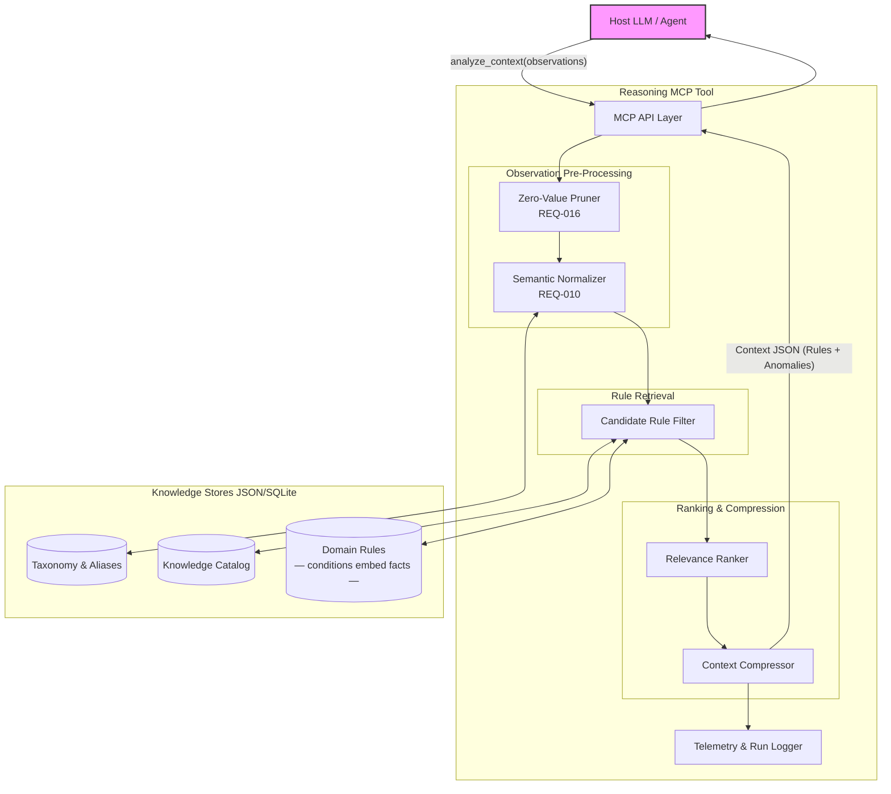
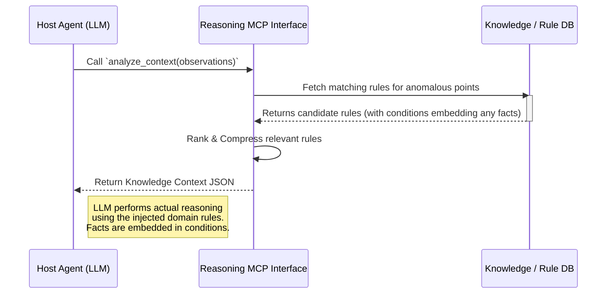

# Knowledge-Augmented Reasoning Tool: Detailed Architecture

## Overview
The **Reasoning Tool** (`reasoning_analyze_context`) is one of two tools hosted on the **general-purpose `reason-mcp` server** — a single, domain-agnostic MCP server that can be deployed by any project simply by pointing the `REASON_KNOWLEDGE_DIR` environment variable at the project's own knowledge folder. The tool itself is a local-first retrieval and knowledge assembly engine strictly isolated from execution or state mutations. Its responsibility is to ingest raw observations, prune noise, retrieve the relevant domain rules (which embed any required facts as conditions), and return a lean knowledge bundle so the **Host LLM** performs the actual reasoning.

Facts are not stored separately.  Physical constants and domain-specific values are expressed directly as `exact` predicates or `natural_language` text within the `conditions` block of each rule.  This eliminates a resolution step and keeps the knowledge model simple and coherent.

---

## 1. System Component Diagram

---

## 2. Core Components Deep Dive

### 2.1 Context Input Pruner (Zero-Value Pruner)
*   **Responsibility:** Implements `REQ-016`. Scans incoming arrays of observations (e.g., 180 telemetry data points) and strips out any values that fall within expected, nominal baselines.
*   **Mechanism:** Uses standard deviation, statically defined nominal ranges, or lightweight SHAP attribution arrays provided by upstream anomaly detectors.
*   **Output:** A vastly reduced array of *only* anomalous/critical observations, significantly reducing the token footprint before the LLM even sees the data.

### 2.2 Semantic Normalizer & Matcher
*   **Responsibility:** Bridges the gap between raw proprietary tags (e.g., `DP_042`) and human-readable text, while resolving linguistic variance (e.g., mapping "vehicle" to "car").
*   **Mechanism:** Uses local vector DB or dictionary alias mapping (`concept_aliases` table) to standardize keys so deterministic rules can evaluate them predictably.

### 2.3 Candidate Rule Filter
*   **Responsibility:** Prevents the system from evaluating the entire database of rules.
*   **Path A — Deterministic matching (always active):** Rules are filtered by `trigger.observations`
    (observation ID overlap) and/or `trigger.keywords` (normalised/expanded keyword intersection).
    Uses OR logic: a rule fires on either hit.  Catch-all rules (no trigger criteria) always match.
*   **Path B — Semantic retrieval (always active, requires `[semantic]` extras):** Every request
    embeds the combined query text (keywords + observation IDs/values) with
    `paraphrase-multilingual-MiniLM-L12-v2` and searches it against a local ChromaDB vector
    index of rule chunks (conditions, reasoning, recommendation, keywords).  Rules above the
    cosine similarity threshold (`semantic_min_score`, default 0.75) are union-merged with
    Path A candidates.  Degrades gracefully to Path A alone if extras are absent or index errors
    occur.
*   Both paths run in **parallel**; results are unioned.  Neither path gates the other.
    A rule from either path is always included in the candidate set.
*   **Keyword normalisation:** Both query keywords and rule trigger.keywords are normalised
    (diacritics stripped, punctuation removed, tokens expanded) before comparison, enabling
    e.g. `"Fr. Schröder"` → `"schroder"` matching.
*   **Performance:** Path A is O(n) with negligible latency.  Path B adds ~20–50 ms warm,
    ~500 ms cold (first model load).
*   **Mechanism:** Uses the normalized trigger tags and current `domain` / `context_state` to perform a fast index lookup, extracting only the `<Rule>` schema items that logically apply to the given situation.

### 2.4 Relevance Compressor (Lean Context Injector)
*   **Responsibility:** Enforces the "Lean Context Window" principle (`REQ-003`). Ensures only the absolute minimum required domain knowledge is injected back to the Host LLM, satisfying "what is really needed, but nothing more".
*   **Mechanism:** 
  1. Ranks the filtered rules and selects the exact `top_k` matches.
  2. Dynamically strips down the rule schemas, removing internal developer metadata/comments not necessary for reasoning.
  3. Returns a highly lean, token-optimized JSON containing only the pruned anomalies and the relevant lean rules.  Any facts embedded in rule conditions are included automatically as part of the selected rules.

---

## 3. Execution Flow (Sequence Diagram)

---

## 4. Key Design Decisions & Guiding Principles
1.  **Local-First & Deterministic (Path A):** Rules fire predictably from exact keyword/observation
    overlap for reproducible, auditable results in high-trust domains.
2.  **Parallel Semantic Retrieval (Path B):** Vector similarity always runs alongside Path A.
    Neither path blocks or filters the other; results are unioned so no rule is missed due to
    phrasing mismatch.
3.  **Multilingual by Default:** The embedding model (`paraphrase-multilingual-MiniLM-L12-v2`)
    handles German and English queries without configuration, supporting real-world NL use cases.
4.  **Facts As Conditions:** Physical constants and domain-specific limits are expressed directly
    within rule conditions (as `exact` predicates with literal values or `natural_language` text).
    There is no separate facts registry or `FACT_*` variable resolution step.
5.  **Aggressive Token Conservation:** Zero-Value Pruning + `top_k=3` guarantee the injected
    context stays lean even when the semantic path broadens the candidate set.
6.  **Strict Boundary:** This tool has absolutely no conception of generating plans.  It yields
    insights (e.g., "The filter is clogged"), but resolving that insight is deferred to the
    Planning Tool.
