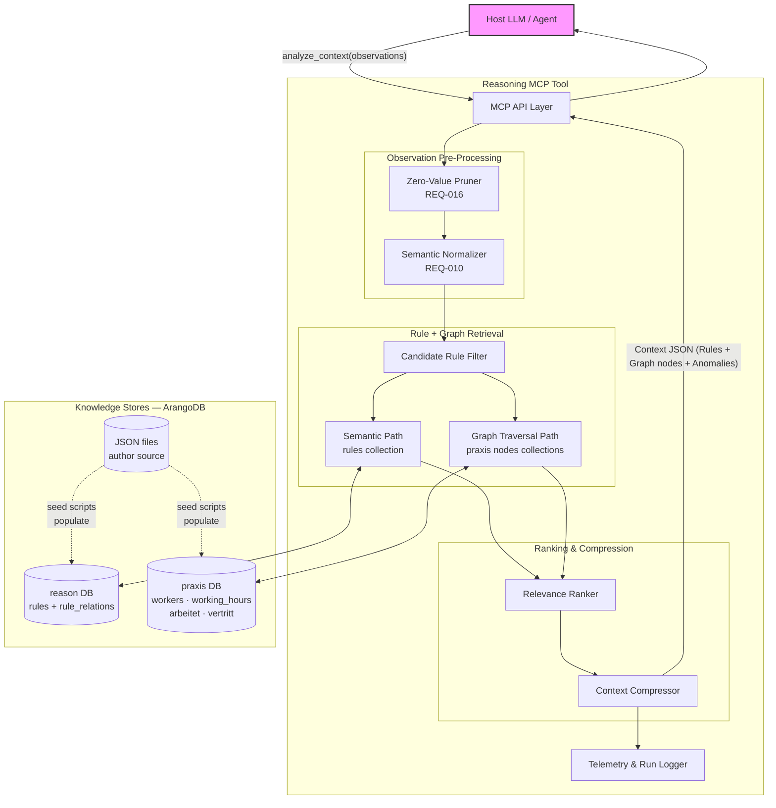
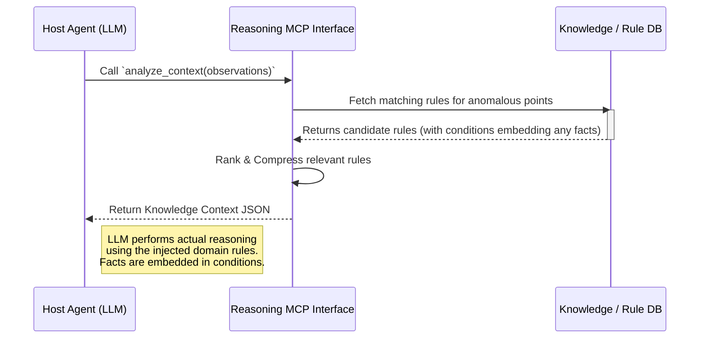

# Knowledge-Augmented Reasoning Tool: Detailed Architecture

## Overview
The **Reasoning Tool** (`reasoning_analyze_context`) is one of two tools hosted on the **general-purpose `reason-mcp` server** — a single, domain-agnostic MCP server that can be deployed by any project simply by pointing the `REASON_KNOWLEDGE_DIR` environment variable at the project's own knowledge folder. The tool itself is a local-first retrieval and knowledge assembly engine strictly isolated from execution or state mutations. Its responsibility is to ingest raw observations, prune noise, retrieve the relevant domain rules (which embed any required facts as conditions), and return a lean knowledge bundle so the **Host LLM** performs the actual reasoning.

Facts are not stored separately.  Physical constants and domain-specific values are expressed directly as `exact` predicates or `natural_language` text within the `conditions` block of each rule.  This eliminates a resolution step and keeps the knowledge model simple and coherent.

---

## 1. System Component Diagram

---

## 2. Core Components Deep Dive

### 2.1 Context Input Pruner (Zero-Value Pruner)
*   **Responsibility:** Implements `REQ-016`. Scans incoming arrays of observations (e.g., 180 telemetry data points) and strips out any values that fall within expected, nominal baselines.
*   **Mechanism:** Uses standard deviation, statically defined nominal ranges, or lightweight SHAP attribution arrays provided by upstream anomaly detectors.
*   **Output:** A vastly reduced array of *only* anomalous/critical observations, significantly reducing the token footprint before the LLM even sees the data.

### 2.2 Semantic Normalizer & Matcher
*   **Responsibility:** Bridges the gap between raw proprietary tags (e.g., `DP_042`) and human-readable text, while resolving linguistic variance (e.g., mapping "vehicle" to "car").
*   **Mechanism:** Uses local vector DB or dictionary alias mapping (`concept_aliases` table) to standardize keys and resolve linguistic variance before passing observation tokens into the semantic query.

### 2.3 Candidate Rule Filter
*   **Responsibility:** Prevents the system from evaluating the entire database of rules.
    Two retrieval paths run in parallel for every call and their results are merged.
*   **Semantic retrieval (always active):** Every request
    builds a query text from the caller's keywords and observation IDs/values, embeds it
    with `paraphrase-multilingual-MiniLM-L12-v2`, and searches the ArangoDB vector index on
    the rules collection for rules above the cosine similarity threshold (`semantic_min_score`,
    default **0.45**).  The semantic path is the primary rule-selection mechanism.
*   **Graph traversal (praxis domain):** A parallel path searches the praxis graph node
    collections (`workers`, `working_hours`) by the same query embedding.  For each matching
    node, a 1-hop OUTBOUND traversal through the `praxis_graph` named graph collects linked
    neighbours (e.g. WorkingHours via `arbeitet`, substitutes via `vertritt`).  Results are
    shaped into rule-like dicts with `_source="graph"` so the compressor can rank them
    alongside regular rule hits.
*   **Catch-all rules (no trigger criteria):** Rules that define no `trigger.observations`,
    `trigger.keywords`, or `trigger.context_states` are always included in the candidate set
    regardless of semantic score.  This ensures default / baseline guidance is never dropped.
    Domain exclusion is the only filter applied to catch-all rules.
*   **Graceful degradation:** If ArangoDB is unavailable, both paths return empty and only
    catch-all rules are returned; no error is raised to the caller.
*   **Performance:** Semantic search adds ~20-50 ms warm, ~500 ms cold (first model load).
    Graph traversal adds a further ~5-15 ms per matched node.

### 2.4 Relevance Compressor (Lean Context Injector)
*   **Responsibility:** Enforces the "Lean Context Window" principle (`REQ-003`). Ensures only the absolute minimum required domain knowledge is injected back to the Host LLM, satisfying "what is really needed, but nothing more".
*   **Mechanism:** 
  1. Ranks the filtered rules and selects the exact `top_k` matches.
  2. Dynamically strips down the rule schemas, removing internal developer metadata/comments not necessary for reasoning.
  3. Returns a highly lean, token-optimized JSON containing only the pruned anomalies and the relevant lean rules.  Any facts embedded in rule conditions are included automatically as part of the selected rules.

---

## 3. Execution Flow (Sequence Diagram)

---

## 4. Key Design Decisions & Guiding Principles
1.  **Semantic-First Retrieval:** Every request builds a query from supplied keywords and
    observation tokens, embeds it, and retrieves rules by vector similarity.  This delivers
    robust recall across paraphrases, synonyms, and multilingual input without a brittle
    exact-match layer.
2.  **Graph Traversal as a Second Retrieval Path:** For graph-backed domains (praxis), the filter
    runs a parallel semantic search over the node collections, followed by a 1-hop AQL graph
    traversal.  Graph results are merged with rule hits before ranking, so entity relationships
    (working hours, substitutes) surface alongside regular rules without any additional tool call
    by the Host LLM.
3.  **Catch-All Safety Net:** Rules with no trigger criteria are always included regardless
    of semantic score.  This guarantees that domain-level default guidance is never silently
    dropped even when the semantic query yields no hits.
4.  **Multilingual by Default:** The embedding model (`paraphrase-multilingual-MiniLM-L12-v2`)
    handles German and English queries without configuration, supporting real-world NL use cases.
5.  **Facts As Conditions:** Physical constants and domain-specific limits are expressed directly
    within rule conditions (as `exact` predicates with literal values or `natural_language` text).
    There is no separate facts registry or `FACT_*` variable resolution step.
6.  **Aggressive Token Conservation:** Zero-Value Pruning + `top_k=3` guarantee the injected
    context stays lean even when the semantic and graph paths broaden the candidate set.
7.  **Strict Boundary:** This tool has absolutely no conception of generating plans.  It yields
    insights (e.g., "The filter is clogged"), but resolving that insight is deferred to the
    Planning Tool.
8.  **ArangoDB as Unified Backend:** Both the rules vector index and the praxis graph use
    ArangoDB.  Rules carry 384-dim embeddings stored as document fields; ArangoDB's
    `APPROX_NEAR_COSINE` provides vector search with a Python-side cosine fallback for older
    deployments.  Named graphs and AQL traversals handle graph queries natively.
9.  **Globally Unique Rule IDs (Critical):** Every `rule_id` must be unique across *all* JSON files
    in a deployment's `REASON_KNOWLEDGE_DIR`.  Duplicate IDs cause the semantic index build to
    emit a `DuplicateIDError`, leaving the index empty and silently disabling semantic retrieval.
    Recommended convention: prefix IDs with a domain abbreviation (`CAR-1`, `PRAX-1`, etc.).
    The loader warns at startup on any collision.
10. **Composite-Key Merge in Filter:** The `filter_candidates()` merge step uses a
    `"<domain>::<rule_id>"` composite key so it remains correct even if two rules share an ID
    across domains.  This is a defence-in-depth measure — unique IDs remain the primary contract.
11. **Semantic Threshold Calibration:** The default `semantic_min_score` is **0.45**, calibrated
    empirically for `paraphrase-multilingual-MiniLM-L12-v2`.  Short fact-rules such as
    *"The weight of a Ford Mustang is about 1500 kg."* score 0.65-0.72 against a related car
    query; the threshold 0.75 was too aggressive and cut all valid hits.  Unrelated rules
    (e.g. German availability text against an English weight query) score <= 0.18.
